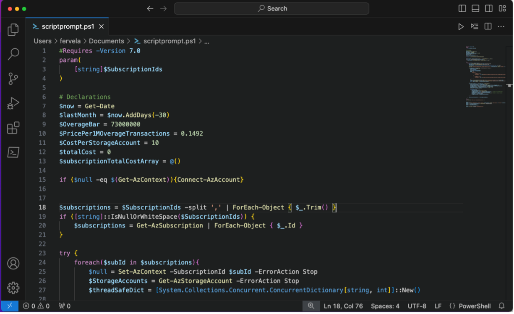
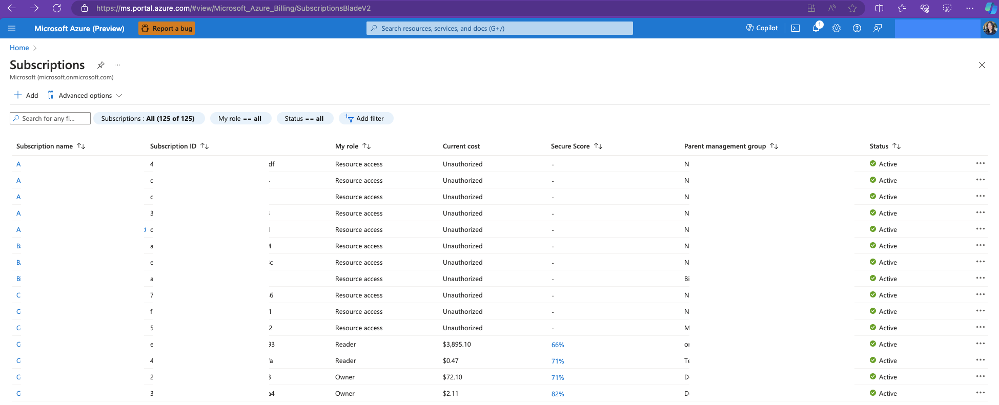
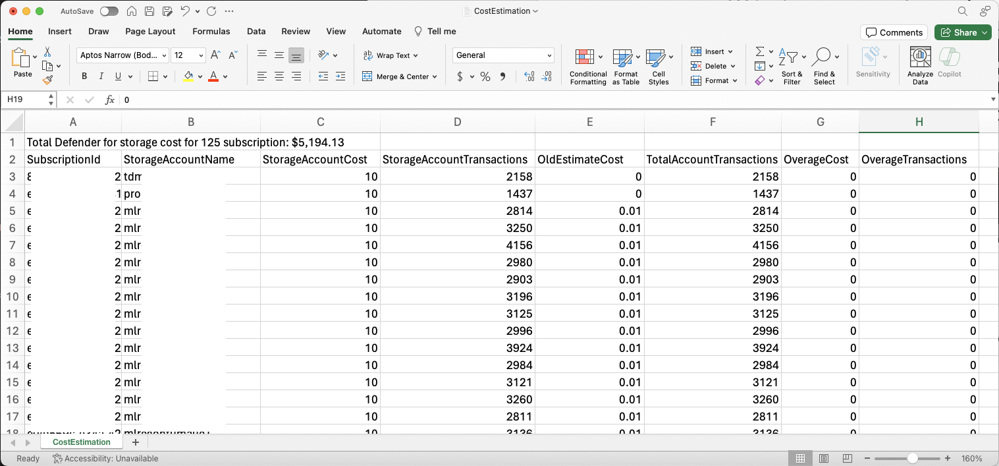

## Microsoft Defender for Storage – Price Estimation Script

> ## Important note
>  
A new pricing plan is now available for Microsoft Defender for Cloud that charges you according to the number of storage accounts it protects (per-storage). The cost in the legacy pricing plan increases according to the number of analyzed transactions in the storage account (per-transaction). The new per-storage plan fixes costs per storage account but accounts with an exceptionally high transaction volume incur an overage charge. For details about the pricing plans, see [Microsoft Defender for Cloud pricing page](https://azure.microsoft.com/pricing/details/defender-for-cloud/)

> The new per-storage plan is only supported on public clouds, and can be enabled only at the subscription level.

Microsoft Defender for Storage is an Azure-native layer of security intelligence that detects unusual and potentially harmful attempts to access or exploit your storage accounts. It uses advanced threat detection capabilities and [Microsoft Threat Intelligence](https://go.microsoft.com/fwlink/?linkid=2128684) data to provide contextual security alerts. Those alerts also include steps to mitigate the detected threats and prevent future attacks.

Microsoft Defender for Storage continuously analyzes the transactions of [Azure Blob Storage](https://azure.microsoft.com/services/storage/blobs/), [Azure Data Lake Storage](https://azure.microsoft.com/services/storage/data-lake-storage/), and [Azure Files](https://azure.microsoft.com/services/storage/files/) services. When potentially malicious activities are detected, security alerts are generated. Alerts are shown in Microsoft Defender for Cloud with the details of the suspicious activity, appropriate investigation steps, remediation actions, and security recommendations. [Learn more about the capabilities here](https://docs.microsoft.com/azure/security-center/defender-for-storage-introduction).

These PowerShell scripts allow you to estimate the cost of the new per-storage pricing plan and it considers all storage accounts with and without Microsoft Defender for Storage enabled across the selected scope.

D4Storage-PricingEstimation-Per-Storage.ps1 executes in serial across each subscription and storage account whereas D4Storage-PricingEstimation-Per-Storage-Parallel.ps1 iterates over each subscription and storage account in parallel.

The results are derived from data extracted from the past month, and the estimation is for the monthly cost. 
>At the end of the script execution CSV file (DefenderEstimatedCostBySubscription.csv) will be saved in the current directory. 

## Important
You can also try the [Microsoft Defender for Storage pricing estimation workbook](https://github.com/Azure/Microsoft-Defender-for-Cloud/tree/main/Workbooks/Microsoft%20Defender%20for%20Storage%20Price%20Estimation).

> **Credits:** [Aviv Shitrit](https://github.com/t-ashitrit), [Eitan Shteinberg](https://www.linkedin.com/in/eitan-shteinberg/), [Fernanda Vela](https://www.linkedin.com/in/mfvelah/), [Shay Amar](https://www.linkedin.com/in/shay-amar/), [Dick Lake](https://www.linkedin.com/in/richard-lake-b3797394/)

# Instructions for running DefenderForStorage-CostEstimation-ResourceLevelVisibility.ps1

## PowerShell script and how it works

You can find the PowerShell script in this [GitHub section](https://github.com/Azure/Microsoft-Defender-for-Cloud/blob/main/Powershell%20scripts/Storage%20Price%20Estimation%20Script/DefenderForStorage-CostEstimation-ResourceLevelVisibility.ps1).

This PowerShell script estimates the monthly cost of Microsoft Defender for Storage for multiple Azure subscriptions. It calculates the cost based on the number of transactions for each storage account in the subscriptions. The script first retrieves the list of subscriptions and then iterates over each subscription to get the list of storage accounts. For each storage account, it retrieves the total number of transactions for the last 30 days using the Azure Monitor REST API. It then calculates the overage cost for transactions exceeding a specified threshold and adds it to the base storage account cost. The script finally outputs the total Defender for Storage cost for all subscriptions and details for each storage account, including the subscription ID, storage account name, storage account cost, total transactions, old estimate cost, overage cost, and overage transactions, to a CSV file named "CostEstimation.csv".

- **PowerShell version:** This script can be run in -Version 7.0 or higher.

- **Data Retrieval:** The script retrieves data using the Azure PowerShell module (Get-AzSubscription and Get-AzStorageAccount) and the Azure Monitor REST API (Invoke-AzRestMethod) for metrics for Azure Blob Storage and Azure Files services. It collects information about subscriptions, storage accounts, and transaction metrics for the last 30 days.

- **Concurrency:** To improve performance, the script uses parallel processing (-Parallel) to handle multiple storage accounts concurrently. This is achieved using the ForEach-Object -Parallel construct, which allows the script to process multiple storage accounts simultaneously.

- **Throttling:** To avoid overwhelming the Azure resources, the script uses the -ThrottleLimit parameter in the ForEach-Object -Parallel loop to limit the number of concurrent requests.

- **Cost Calculation:** The script calculates the cost for each storage account based on the total number of transactions. It determines if the transactions exceed a predefined threshold ($OverageBar = 73Million) and calculates the overage cost accordingly. For more information about pricing, visit this [link](https://azure.microsoft.com/en-us/pricing/details/defender-for-cloud/).

- **Error Handling:** The script includes error handling (try-catch) to manage any errors that may occur during the data retrieval and processing. If an error occurs, it is caught, and an error message is displayed.

- **Output Formatting:** The script formats the output into a CSV file (CostEstimation.csv) using ConvertTo-Csv, which can be easily imported into Excel or other tools for further analysis. The file is saved in the current directory where the script is executed.

## How to use the PowerShell script to get the resource level cost of your storage accounts

You can find the PowerShell script in this [GitHub section](https://github.com/Azure/Microsoft-Defender-for-Cloud/blob/main/Powershell%20scripts/Storage%20Price%20Estimation%20Script/DefenderForStorage-CostEstimation-ResourceLevelVisibility.ps1).

1. Click on the PowerShell script.

2. On the right side, click on “Raw”.

3. Copy the code.

4. Paste it in your favorite code tool. In this example we’ll use Visual Studio Code.

5. Save it. In this example we’ll save it as scriptprompt.ps1.
6. For this example, I had one of the following roles in different subscriptions: `“Resource Access”, “Reader”, or “Owner”`. You can verify your roles by going to the Azure Portal and opening “Subscriptions”.

7. Here we’ll use Terminal that already has PowerShell installed to run the code. Write: `pwsh`

8. Connect to your Azure account using `Connect-AzAccount -TenantId INSERT_TENANT_ID`

9. Go into the directory where you saved your PowerShell script. In this example, it is saved in Documents.

10. If you want to specify a list of subscription Ids separated by commas (no spaces), write in your console: `pwsh ./scriptprompt.ps1 -SubscriptionIds INSERT_SUB1,INSERT_SUB2,INSERT_SUBN`

11. If you don’t want to specify it, write in your console: `pwsh ./scriptprompt.ps1`

12. Hit enter. This can take some time (seconds to minutes) if you have hundreds to thousands of subscriptions and storage accounts. Keep your Terminal open until you get a new input line.

13. Open your csv file in your current path. In this example, it is in Documents.

### .CSV file 
The CSV file includes the following information:
- Total Defender for Storage V2 cost for X subscriptions. This is the sum of column C “StorageAccountCost”.
- Subscription ID.
- Storage Account Name.
- Storage Account Transactions in the past 30 days.
- Old Estimate Cost which is how much the Defender for Cloud (Classic) plan would be for that storage account.
- Overage Cost associated if the storage account had more than 73 million transactions.
- Overage Transactions which are after the storage account passed the 73 million transactions.
