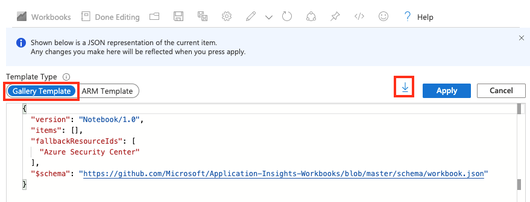

# Azure  Workbooks for Azure Security Center

This project contains **Azure Workbook templates** you can use to create custom dashboards within Azure Security Center. The workbooks can be deployed as ARM templates to your Azure Security Center environment.

## Contributing

Anyone can contribute, you don't need to be a pro. You have an interesting query or workbook? Then fork this repo, add your content to your fork and submit a pull request. See our [Contribution Guideline](../Contributing.md) for more details.

In addition to the overall contribution guideline, please make sure to adhere to the following aspects when submitting a new workbook:

1. Add a **screenshot** of the workbook
2. Ensure all steps have **meaningful names**
3. Ensure all parameters and grid columns have **display names** set so they can be localized
4. Ensure that parameters id values are **unique**
5. Ensure that steps names are **unique**
6. Grep /subscription/ and ensure that your parameters don't have **any hardcoded resourceIds**
7. Remove **fallbackResourceIds** and **fromTemplateId** fields from your template workbook

## How to create a .workbook file

There are three ways of creating a template:

- Create a new template based on an empty workbook.
- Create a new template based on an existing template. You can modify or enhance the existing template.
- Create a new template from an existing report. You can modify or enhance the existing report.

### Create from an empty workbook

1. Go to http://portal.azure.com 
2. Select Azure Security Center from the navigation menu
3. Select "Workbooks"
4. Select the Empty workbook in the Quick Start section.
    
5. Modify report as you wish and click "Advanced Editor" button from the menu. 
    
6. Use the download button or copy all contents and create a file like `your custom template name.workbook`. 
   Make sure the file name ends with `.workbook` and avoid using any special characters (like `/\&?`) in your file name.
    

### Create from an existing template

1. Go to http://portal.azure.com 
2. Select Azure Security Center from the navigation bar.
3. Select "Workbooks"
4. Select a template you are interested in editing.
5. Modify as you wish and click "Advanced Editor" button from the menu.
6. Use the download button, or copy contents and create a file like `your custom template name.workbook`.
   Make sure the file name ends with `.workbook` and avoid using any special characters (like `/\&?`) in your file name.

### Create from a saved workbook

1. Go to http://portal.azure.com 
2. Select Azure Security Center from the navigation bar.
3. Select "Workbooks"
4. Click on the Open icon from the menu.
   
5. Select a desired saved workbook you want to start with.
6. Modify the workbook as you wish and click the "Advanced Editor" button from the menu.
7. Use the download button, or copy contents and create a file like `your custom template name.workbook`. Make sure the file name ends with `.workbook` and avoid using any special characters (like `/\&?`) in your file name.
